# 📉 Customer Churn Intelligence & Statistical Modeling Platform

An end-to-end churn intelligence platform combining **statistical inference, predictive machine learning, explainable AI, business-oriented threshold optimization, FastAPI, Streamlit, Docker, AWS ECR/ECS and GitHub Actions CI/CD**.

[](https://cu-7228b07aa9bc45d388445b9a7f9ff667.ecs.ap-south-1.on.aws/)
[](https://cu-4925d847130f42e8bc1611cf44225d72.ecs.ap-south-1.on.aws/docs)


| 🔗 Link | URL |
|---|---|
| **Live Dashboard (Streamlit)** | https://cu-7228b07aa9bc45d388445b9a7f9ff667.ecs.ap-south-1.on.aws/ |
| **Production API (FastAPI)** | https://cu-4925d847130f42e8bc1611cf44225d72.ecs.ap-south-1.on.aws/ |
| **Swagger Docs** | https://cu-4925d847130f42e8bc1611cf44225d72.ecs.ap-south-1.on.aws/docs |

---

## 🏆 Production Results

| Area | Result |
|---|---:|
| Dataset | 7,043 customers |
| Churn rate | 26.54% |
| Modeling features | 26 |
| Transformed features | 56 |
| Best CV PR-AUC | 0.6671 |
| **Test ROC-AUC** | **0.8429** |
| **Test PR-AUC** | **0.6539** |
| **Test Recall** | **92.78%** |
| Test Precision | 42.16% |
| Test F1 | 0.5798 |
| Test Accuracy | 64.30% |
| Test Brier score | 0.1366 |
| Optimal threshold | 0.11 |
| Business score | 0.7506 |
| Statistical tests | 26 (24 significant) |
| Logistic model AIC | 5877.33 |
| Deployment | AWS ECR + ECS Express Mode (`ap-south-1`) |
| Explainability | SHAP |
| Model version | 3.0.0 |

### Test-set performance at a glance

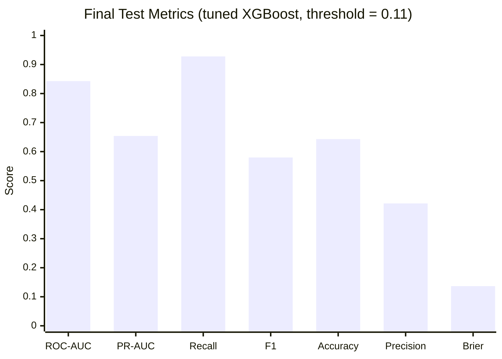

---

## 📑 Table of Contents

1. [Project Overview](#-project-overview)
2. [Business Problem](#-business-problem)
3. [Objectives](#-objectives)
4. [Dataset](#-dataset)
5. [Data Quality & Preparation](#-data-quality--preparation)
6. [Feature Engineering](#-feature-engineering)
7. [Statistical Analysis](#-statistical-analysis)
8. [Machine Learning Pipeline](#-machine-learning-pipeline)
9. [Cross-Validation Results](#-cross-validation-results)
10. [Hyperparameter Optimization](#-hyperparameter-optimization)
11. [Threshold Optimization](#-threshold-optimization)
12. [Final Test Results](#-final-test-results)
13. [SHAP Explainability](#-shap-explainability)
14. [Risk Segmentation](#-risk-segmentation)
15. [API](#-api)
16. [Streamlit Dashboard](#-streamlit-dashboard)
17. [Model Governance](#-model-governance)
18. [System Architecture](#-system-architecture)
19. [Repository Structure](#-repository-structure)
20. [Docker](#-docker)
21. [AWS Deployment](#-aws-deployment)
22. [CI/CD](#-cicd)
23. [Installation & Running Locally](#-installation--running-locally)
24. [Example Prediction](#-example-prediction)
25. [Technologies](#-technologies)
26. [Data Science Concepts Demonstrated](#-key-data-science-concepts-demonstrated)
27. [Why It Matters](#-why-it-matters)
28. [Limitations](#-limitations)
29. [Future Improvements](#-future-improvements)
30. [Author](#-author)

---

## 🔎 Project Overview

Customer churn prediction identifies customers likely to discontinue a service. This project implements a complete, production-oriented churn intelligence system that goes beyond classification by combining:

- Exploratory customer analytics
- Statistical hypothesis testing (Chi-square, Cramér's V, Mann-Whitney U)
- Logistic regression statistical inference (odds ratios, CIs, AIC)
- 5-fold stratified cross-validation
- Logistic Regression and XGBoost baselines
- XGBoost randomized hyperparameter optimization
- Probability quality analysis using Brier score
- Business-oriented threshold optimization
- SHAP explainability and customer-level risk scoring
- Batch prediction and model governance reporting
- FastAPI inference API + Streamlit analytical dashboard
- Dockerized deployment on AWS ECR + ECS Express Mode with GitHub Actions CI/CD

Rather than judging by accuracy alone, the project evaluates **ROC-AUC, PR-AUC, F1, Precision, Recall, Accuracy, Brier score, CV stability, statistical significance, feature associations, explainability and business-driven thresholds.**

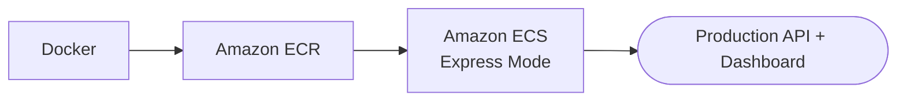

---

## 💼 Business Problem

A telecom company wants to identify customers at risk of churn to support retention, targeted campaigns, segmentation, revenue-at-risk estimation and prioritisation. A production system must answer:

- **Which** customers are at risk?
- **How confident** is the model?
- **Which factors** are associated with churn?
- **Which features** drive an individual prediction?
- **How stable** is the model across samples?
- **What threshold** should trigger intervention?
- **Can it be deployed and monitored reliably?**

---

## 🎯 Objectives

| # | Objective | Approach |
|---|---|---|
| 1 | Predict churn probability | XGBoost / Logistic Regression |
| 2 | Identify high-risk customers | Probability → risk bands |
| 3 | Understand churn drivers | Statistical inference + SHAP |
| 4 | Compare statistical vs ML | Logistic Regression vs XGBoost |
| 5 | Validate stability | Stratified 5-fold CV |
| 6 | Optimize operating threshold | Recall-weighted business score |
| 7 | Deploy the model | FastAPI + Streamlit |
| 8 | Automate deployment | GitHub Actions → ECR → ECS |

---

## 📦 Dataset

**IBM Telco Customer Churn** — 7,043 rows × 21 columns. Target: `Churn`.

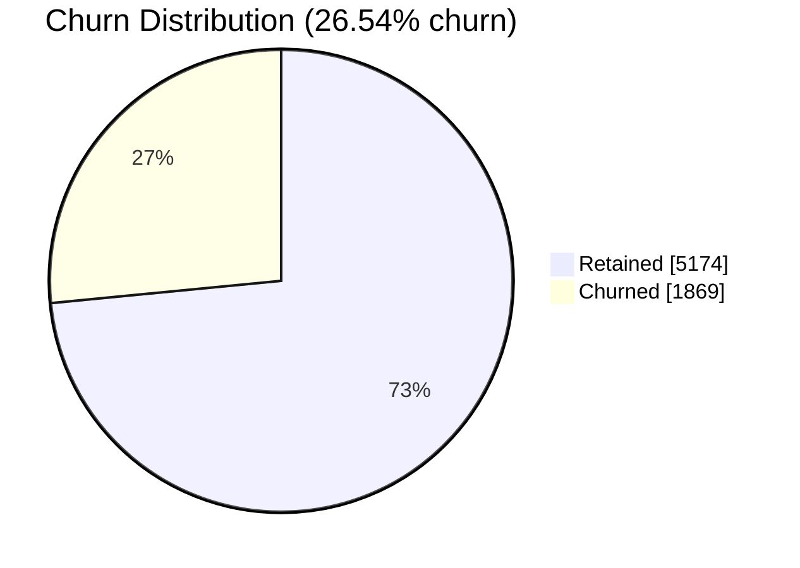

| Group | Columns |
|---|---|
| Customer | `customerID`, `gender`, `SeniorCitizen`, `Partner`, `Dependents` |
| Account | `tenure`, `Contract`, `PaperlessBilling`, `PaymentMethod` |
| Services | `PhoneService`, `MultipleLines`, `InternetService`, `OnlineSecurity`, `OnlineBackup`, `DeviceProtection`, `TechSupport`, `StreamingTV`, `StreamingMovies` |
| Billing | `MonthlyCharges`, `TotalCharges` |
| Target | `Churn` |

Roughly **1 in 4 customers** churned in the dataset.

---

## 🧹 Data Quality & Preparation

The preprocessing pipeline handles missing values, numeric conversion, categorical encoding, feature construction and consistent inference-time transformations.


The same preprocessing pipeline is **persisted with the model**, so training and production inference always use identical transformations.

---

## 🛠 Feature Engineering

| Feature | Purpose |
|---|---|
| `service_count` | Number of subscribed services — proxy for engagement / product adoption |
| `tenure_group` | Customer lifecycle bands capturing non-linear tenure effects |
| `monthly_to_tenure_value` | Combines monthly charges and tenure for account value vs relationship length |
| `avg_monthly_revenue` | Normalized revenue-related feature |
| `contract_risk_flag` | Binary flag for contract-related churn risk |
| `fiber_risk_flag` | Binary flag for the fiber-optic internet risk relationship |
| `support_gap_flag` | Absence of relevant technical/support services |

---

## 📐 Statistical Analysis

A dedicated statistical pipeline (SciPy, Statsmodels, Pandas, NumPy) runs alongside the ML pipeline.

| Statistic | Value |
|---|---:|
| Sample size | 7,043 |
| Churn rate | 26.54% |
| Categorical tests | 16 |
| Significant categorical | 14 |
| Numeric tests | 10 |
| Significant numeric | 10 |
| Significant logit terms | 10 |
| Logistic model AIC | 5877.33 |

```mermaid
xychart-beta
    title "Statistical Tests: Total vs Significant"
    x-axis ["Categorical (Chi-square)", "Numeric (Mann-Whitney U)"]
    y-axis "Number of tests" 0 --> 18
    bar [16, 10]
    bar [14, 10]
```

*(First bar series = tests run, second = significant.)*

### Methods

| Test | Applies to | Why |
|---|---|---|
| **Chi-square** | Categorical vs churn | Tests evidence of association |
| **Cramér's V** | Significant categorical | Measures *strength* of association (significance ≠ effect size) |
| **Mann-Whitney U** | Numeric vs churn | Non-parametric; no normality assumption |
| **Logistic regression (Statsmodels)** | Multivariate | Coefficients, odds ratios, confidence intervals, p-values, AIC |

---

## 🧪 Machine Learning Pipeline

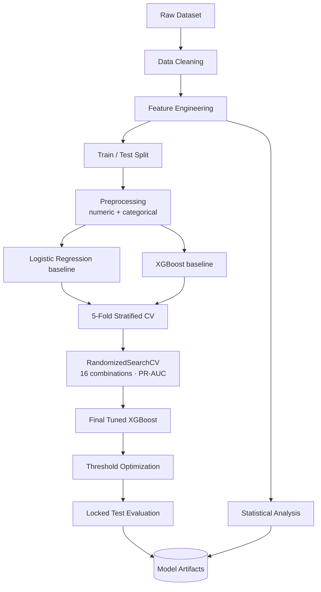

Models are evaluated on a **locked test set** after model development. `StratifiedKFold` (5 folds) reports mean and standard deviation for ROC-AUC, PR-AUC, F1, Accuracy and Brier score.

---

## 📊 Cross-Validation Results

### Logistic Regression

| Metric | Mean | Std |
|---|---:|---:|
| ROC-AUC | 0.8479 | 0.0110 |
| PR-AUC | 0.6668 | 0.0149 |
| F1 | 0.6287 | 0.0208 |
| Accuracy | 0.7526 | 0.0127 |
| Brier Score | 0.1627 | 0.0051 |

### XGBoost Baseline

| Metric | Mean | Std |
|---|---:|---:|
| ROC-AUC | 0.8442 | 0.0101 |
| PR-AUC | 0.6577 | 0.0205 |
| F1 | 0.5785 | 0.0297 |
| Accuracy | 0.7994 | 0.0140 |
| Brier Score | 0.1362 | 0.0053 |

### Tuned XGBoost

| Metric | Mean | Std |
|---|---:|---:|
| ROC-AUC | 0.8479 | 0.0101 |
| PR-AUC | 0.6671 | 0.0207 |
| F1 | 0.5839 | 0.0261 |
| Accuracy | 0.8026 | 0.0117 |
| Brier Score | 0.1343 | 0.0050 |

### Model comparison charts

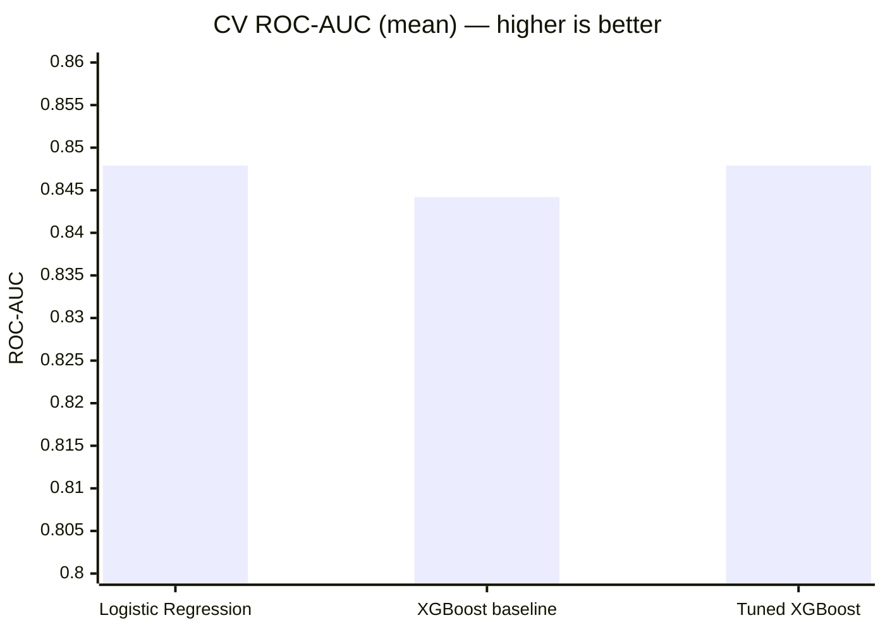

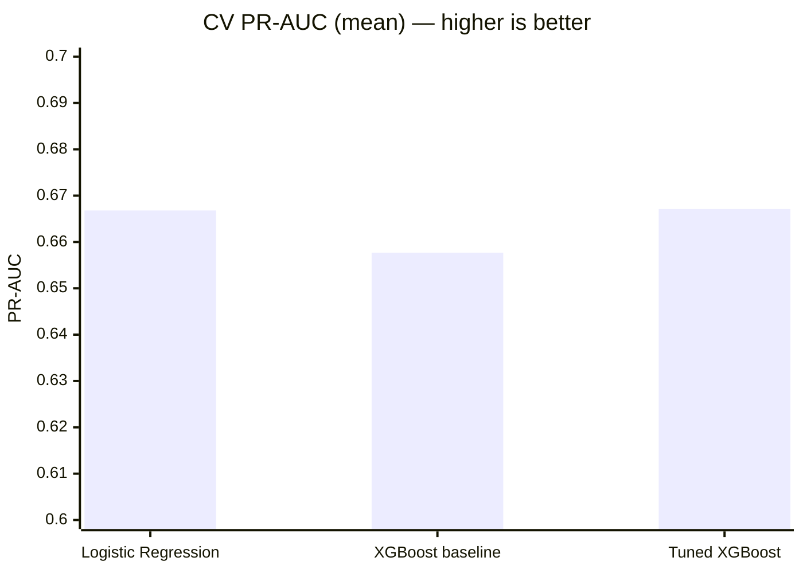

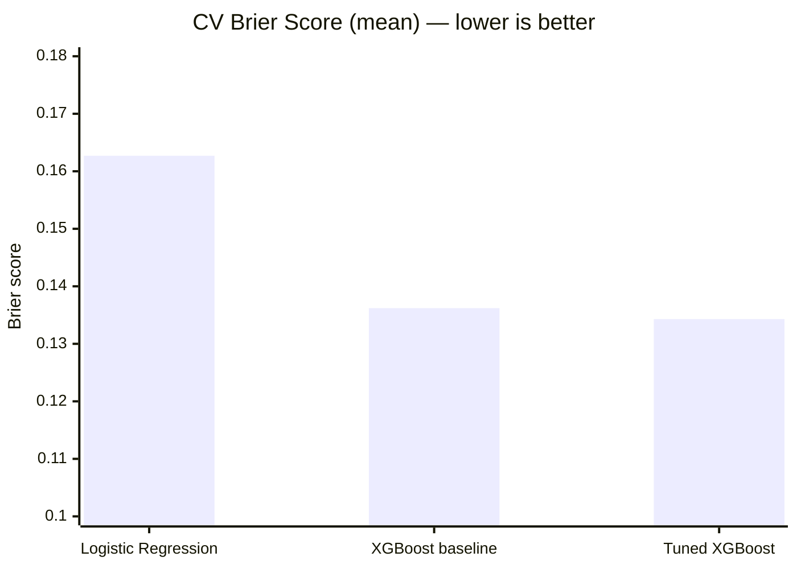

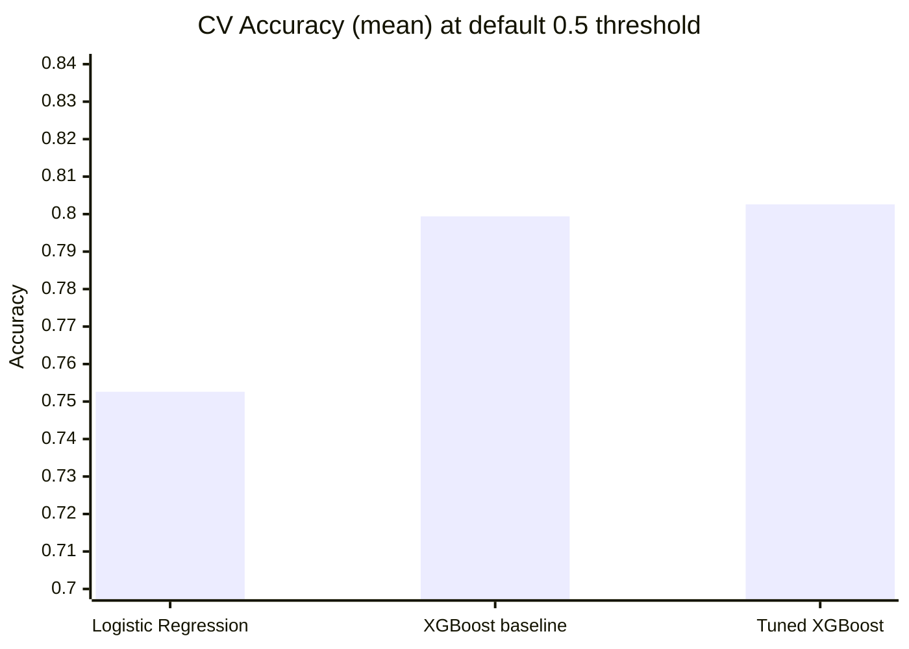

**Takeaways**

- Logistic Regression is a strong, interpretable baseline — ranking metrics (ROC-AUC, PR-AUC) are effectively tied with tuned XGBoost.
- Tuned XGBoost gives the **best probability calibration** (lowest Brier score, 0.1343) and best accuracy, which matters for revenue-at-risk estimates and risk bands.
- Fold-to-fold standard deviations are small (~0.01 for ROC-AUC), indicating stable performance.

---

## 🎛 Hyperparameter Optimization

`RandomizedSearchCV` — **16 parameter combinations**, optimizing **Average Precision (PR-AUC)** because churn is imbalanced and precision–recall behaviour is what matters when hunting churners.

```python
{
    "subsample": 0.85,
    "min_child_weight": 3,
    "max_depth": 4,
    "learning_rate": 0.02,
    "colsample_bytree": 1.0
}
```

Best CV average precision: **0.6671**

---

## ⚖️ Threshold Optimization

The default `0.50` threshold is **not assumed optimal**. The operating point is chosen with a business-oriented objective:

```text
Business Score = 0.65 × Recall + 0.35 × Precision
```

| Result | Value |
|---|---:|
| Selected threshold | **0.11** |
| Business score | **0.7506** |

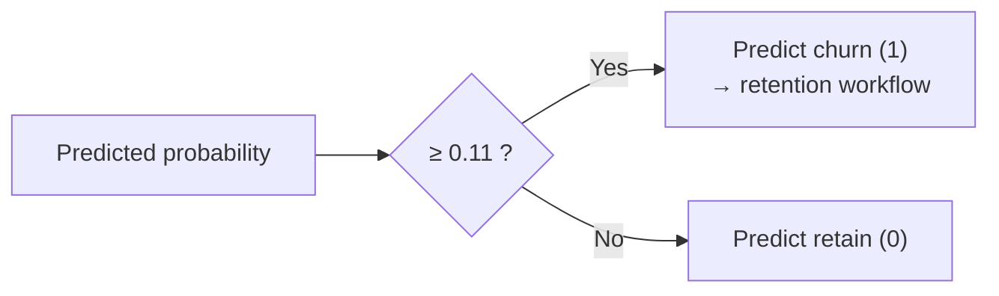

The threshold intentionally weights recall over precision to support a retention workflow where **missing a churner is costlier than contacting a loyal customer**. It is treated as a *business decision layer*, separate from the probability model.

---

## ✅ Final Test Results

Tuned XGBoost on the locked test set:

| Metric | Result |
|---|---:|
| ROC-AUC | **0.8429** |
| PR-AUC | **0.6539** |
| Brier Score | **0.1366** |
| Accuracy | **0.6430** |
| Precision | **0.4216** |
| Recall | **0.9278** |
| F1 | **0.5798** |

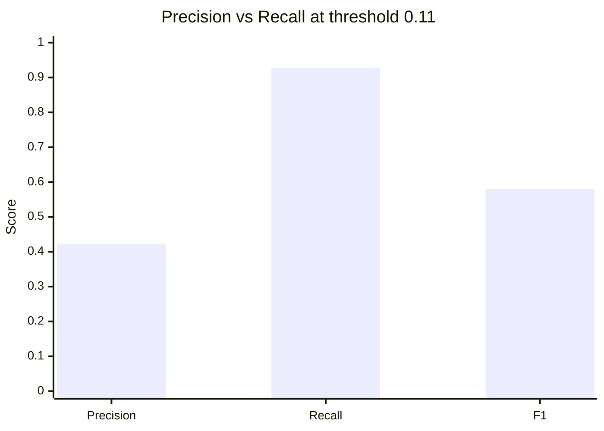

### Interpreting the metrics

| Metric | Reading |
|---|---|
| **ROC-AUC 0.8429** | Strong discrimination between churners and non-churners across thresholds |
| **PR-AUC 0.6539** | Solid precision–recall behaviour on the minority churn class |
| **Recall 92.78%** | The model catches ~93% of actual churners — valuable when misses are costly |
| **Precision 42.16%** | ~42% of flagged customers truly churn — the price of a recall-first threshold |
| **F1 0.5798** | Balance of precision and recall |
| **Accuracy 64.30%** | Reported but *not* the optimization target (imbalanced classes, low threshold) |
| **Brier 0.1366** | Good probabilistic accuracy (lower is better) |

---

## 🔍 SHAP Explainability

SHAP explains each XGBoost prediction: churn probability, risk class, top contributing features, contribution values and direction.

Example explanation for one customer:

| Feature | SHAP value | Effect |
|---|---:|---|
| `contract_risk_flag` | **+0.5554** | ⬆ increases risk |
| `fiber_risk_flag` | **+0.2416** | ⬆ increases risk |
| `PaymentMethod_Electronic check` | **+0.2016** | ⬆ increases risk |
| `MultipleLines_No` | **−0.1835** | ⬇ decreases risk |

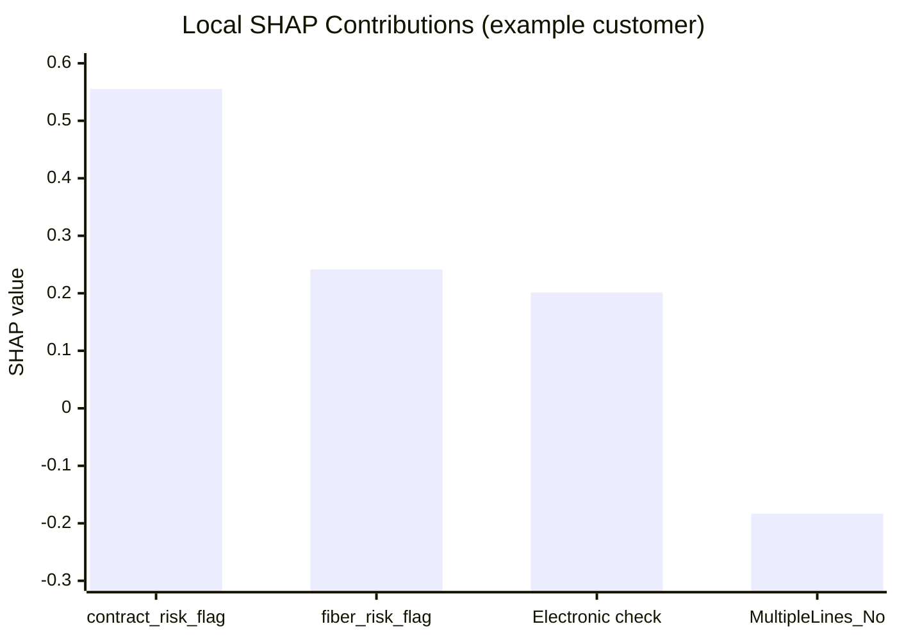

Positive values push the prediction toward churn; negative values push it away. This moves users from *"What did the model predict?"* to *"Why did it predict that?"*

---

## 🚦 Risk Segmentation

The API converts probabilities into operational output using the optimized threshold (`0.11`):

- Churn probability
- Risk band
- Binary prediction
- Threshold used
- Estimated monthly revenue at risk
- Retention recommendation
- Model version

```json
{
    "churn_probability": 0.5753270983695984,
    "risk_band": "Medium",
    "prediction": 1,
    "threshold": 0.11,
    "estimated_monthly_revenue_at_risk": 49.19,
    "recommendation": "Moderate-risk customer. Place into a monitored retention segment and review engagement.",
    "model_version": "3.0.0"
}
```

---

## 🔌 API

Built with **FastAPI** (port `8000`).

| Method | Endpoint | Description |
|---|---|---|
| `GET` | `/` | API information and model version |
| `GET` | `/health` | Health check |
| `GET` | `/ready` | Readiness check |
| `GET` | `/metrics` | Training and evaluation metrics |
| `POST` | `/predict` | Single-customer churn prediction |
| `POST` | `/explain` | SHAP-based prediction explanation |
| `POST` | `/batch-predict` | Batch customer scoring |
| `GET` | `/statistics` | Statistical analysis results |

Health response:

```json
{ "status": "ok", "model_loaded": true }
```

---

## 🖥 Streamlit Dashboard

Built with **Streamlit** (port `8501`) with multiple analytical views:

| View | Contents |
|---|---|
| **Executive Overview** | Dataset summary, churn rate, model performance, risk distribution, business metrics, model version |
| **Statistical Evidence** | Sample size, churn rate, categorical & numeric tests, significant relationships, logistic inference, AIC |
| **Customer 360** | Churn probability, risk class, customer attributes, revenue info, retention recommendation |
| **SHAP Explainability** | Feature contributions, positive/negative risk drivers, customer-level explanation |
| **Batch Scoring** | Score many customers: probability, risk band, prediction, revenue at risk, recommendations |
| **Model Governance** | Version, dataset size, feature counts, train/test/CV metrics, threshold, statistical model, artifacts |

---

## 🗄 Model Governance

Model metadata is stored alongside the artifact:

```text
models/
├── churn_pipeline.joblib     # preprocessing + model in one pipeline
├── metrics.json              # training / CV / test metrics
└── feature_contract.json     # expected input schema
```

**Current production model version: `3.0.0`**

---

## 🏗 System Architecture

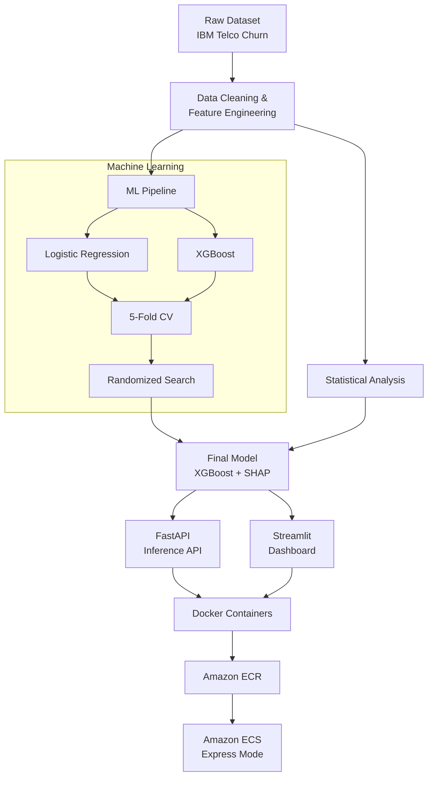

### Production topology

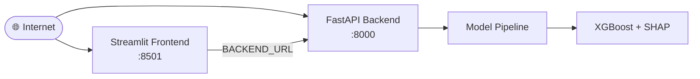

### Request flow

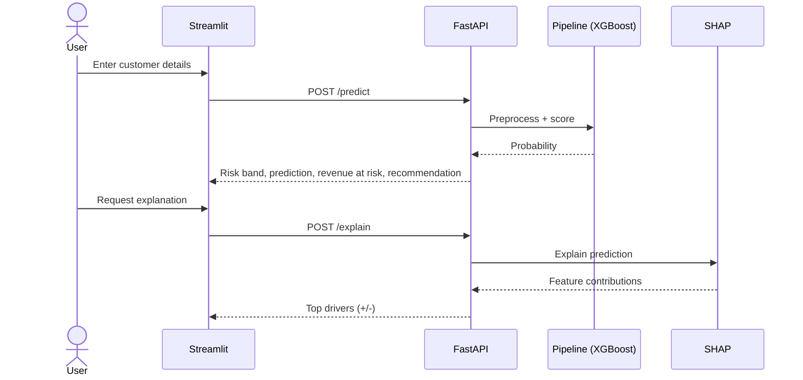

---

## 🗂 Repository Structure

```text
customer-churn-aws/
├── api/
│   └── main.py
├── frontend/
│   └── app.py
├── src/
│   ├── pipeline.py
│   ├── statistics.py
│   └── ...
├── scripts/
│   └── train.py
├── models/
│   ├── churn_pipeline.joblib
│   ├── metrics.json
│   └── feature_contract.json
├── data/
│   └── raw/Telco-Customer-Churn.csv
├── tests/
├── Dockerfile.api
├── Dockerfile.frontend
├── requirements.txt
├── .github/workflows/
│   ├── ci.yml
│   ├── deploy-api.yml
│   └── deploy-frontend.yml
└── README.md
```

---

## 🐳 Docker

| Container | Stack | Port |
|---|---|---|
| **Backend** | Python 3.11, FastAPI, Uvicorn, scikit-learn, XGBoost, SHAP, Statsmodels | `8000` |
| **Frontend** | Python 3.11, Streamlit, Plotly, Requests | `8501` |

---

## ☁️ AWS Deployment

| Item | Value |
|---|---|
| Region | `ap-south-1` (Mumbai) |
| ECR repositories | `customer-churn-api`, `customer-churn-frontend` (private) |
| ECS backend service | `customer-churn-api` |
| ECS frontend service | `customer-churn-frontend-2167` |
| Mode | ECS Express Mode |

---

## 🔁 CI/CD

GitHub Actions automates: checkout → Python env → tests → Docker build → ECR login → image push → digest retrieval → ECS Express Mode deployment → deployment verification.

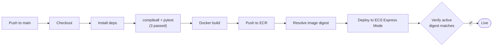

**Continuous Integration** (every push & PR):

```bash
pip install -r requirements.txt
python -m compileall src api frontend scripts
pytest -q          # 3 passed
```

**Immutable image deployment:** the workflow resolves the exact ECR **image digest** instead of relying on the mutable `latest` tag, then verifies that the active ECS configuration uses the expected digest.

---

## 💻 Installation & Running Locally

```bash
git clone https://github.com/Harshithpatali/customer-churn-aws.git
cd customer-churn-aws

python -m venv .venv
.venv\Scripts\activate          # Windows
# source .venv/bin/activate     # Linux / macOS

pip install -r requirements.txt
```

### Train the model

```bash
python -m scripts.train
```


### Run the API

```bash
uvicorn api.main:app --reload
# http://localhost:8000      Swagger: http://localhost:8000/docs
```

### Run the dashboard

```bash
streamlit run frontend/app.py
# http://localhost:8501
```

---

## 🧾 Example Prediction

**Request**

```json
{
    "gender": "Female",
    "SeniorCitizen": 0,
    "Partner": "Yes",
    "Dependents": "No",
    "tenure": 1,
    "PhoneService": "No",
    "MultipleLines": "No phone service",
    "InternetService": "DSL",
    "OnlineSecurity": "No",
    "OnlineBackup": "Yes",
    "DeviceProtection": "No",
    "TechSupport": "No",
    "StreamingTV": "No",
    "StreamingMovies": "No",
    "Contract": "Month-to-month",
    "PaperlessBilling": "Yes",
    "PaymentMethod": "Electronic check",
    "MonthlyCharges": 29.85,
    "TotalCharges": 29.85
}
```

**Response**

```json
{
    "churn_probability": 0.5753270983695984,
    "risk_band": "Medium",
    "prediction": 1,
    "threshold": 0.11,
    "estimated_monthly_revenue_at_risk": 49.19,
    "recommendation": "Moderate-risk customer. Place into a monitored retention segment and review engagement.",
    "model_version": "3.0.0"
}
```

---

## 🧰 Technologies

| Category | Tools |
|---|---|
| Programming | Python, SQL |
| Data Science | Pandas, NumPy, SciPy, Statsmodels |
| Machine Learning | Scikit-learn, XGBoost |
| Explainable AI | SHAP |
| Visualization | Plotly, Matplotlib, Streamlit |
| API | FastAPI, Uvicorn, Pydantic |
| Deployment | Docker, Amazon ECR, Amazon ECS, ECS Express Mode, GitHub Actions |
| Testing | Pytest |

---

## 🧠 Key Data Science Concepts Demonstrated

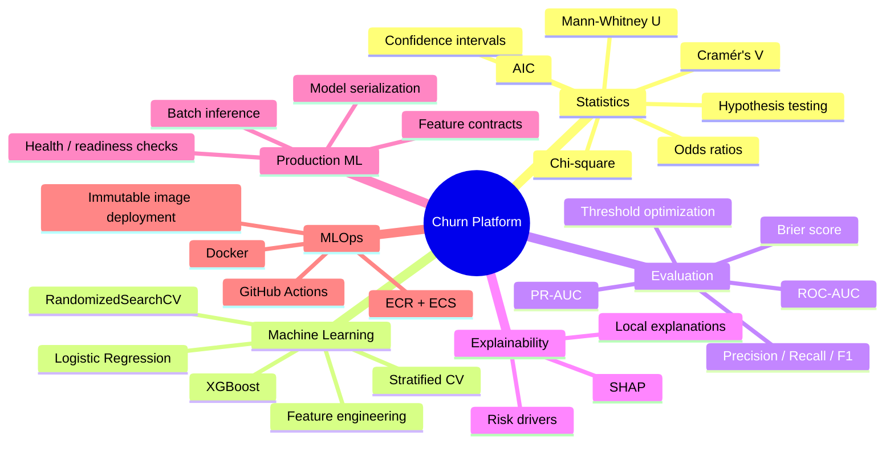

---

## 💡 Why It Matters

**Why PR-AUC?** The data is 26.54% churn / 73.46% non-churn. Accuracy alone is misleading, so the project emphasizes PR-AUC, recall, precision and F1 alongside ROC-AUC and Brier score.

**Why cross-validation?** A single split can give an unstable estimate. 5-fold stratified CV reports mean ± std for each metric, showing stability across folds.

**Why statistical modeling *and* ML?**

| Perspective | Question answered |
|---|---|
| Statistical | Are variables associated with churn? |
| Predictive | How accurately can churn be predicted? |
| Explainability | Which features drove *this* prediction? |

**Why threshold optimization?** A `0.50` cutoff is rarely right for retention. Missing a high-risk customer has a different cost from contacting one who would have stayed, so the threshold (`0.11`, maximizing `0.65·Recall + 0.35·Precision`) is a separate business decision layer.

---

## ⚠️ Limitations

- **Dataset size:** 7,043 customers is fine for demonstrating methodology but small versus enterprise telecom data.
- **Observational data:** associations found here do not establish causality.
- **Threshold assumptions:** the `0.65 / 0.35` weighting is a modeling assumption. A real organization should set it from retention cost, customer lifetime value, campaign/contact cost, intervention success rate and revenue impact.
- **No external validation:** the model hasn't been tested on a separate telecom dataset.
- **Precision trade-off:** the recall-first threshold yields 42.16% precision and 64.30% accuracy by design.

---

## 🛣 Future Improvements

- [ ] Cost-sensitive threshold optimization
- [ ] Calibration curves, isotonic calibration, Platt scaling
- [ ] Population Stability Index, data & concept drift detection
- [ ] Automated retraining, model registry and rollback
- [ ] MLflow experiment tracking, feature store integration
- [ ] AWS CloudWatch monitoring
- [ ] A/B testing of retention strategies
- [ ] Customer lifetime value integration, uplift modeling
- [ ] Survival analysis / time-to-churn modeling
- [ ] SHAP global feature-importance monitoring
- [ ] Automated statistical reporting

---

## 🎯 Project Outcome

The project evolved from a conventional churn classifier into a complete **Customer Churn Intelligence Platform**:

```text
Data + Statistics + Machine Learning + Explainability
+ Business Decisioning + API + Dashboard + Docker + AWS + CI/CD
```

---

## 👤 Author

**Harshith Devaraja** — Data Scientist | Advanced Analytics | Statistical Modeling | Machine Learning (India)

**Focus areas:** Data Science · Statistical Modeling · Predictive Analytics · Machine Learning · Customer Analytics · Experimentation · Explainable AI · Big Data · MLOps

- GitHub: [Harshithpatali/customer-churn-aws](https://github.com/Harshithpatali/customer-churn-aws)
- Production Dashboard: https://cu-7228b07aa9bc45d388445b9a7f9ff667.ecs.ap-south-1.on.aws/
- Production API: https://cu-4925d847130f42e8bc1611cf44225d72.ecs.ap-south-1.on.aws/
- API Docs: https://cu-4925d847130f42e8bc1611cf44225d72.ecs.ap-south-1.on.aws/docs

---

⭐ If you found this project useful, consider giving it a star!
